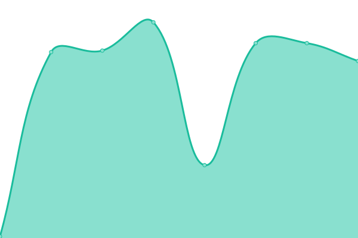

<h1>Suivi en temps réel des services Vibly</h1>

# [📈 Live Status](https://demo.upptime.js.org): <!--live status--> **Tous les systèmes sont opérationnels**

<!--start: status pages-->
<!-- This summary is generated by Upptime (https://github.com/upptime/upptime) -->
<!-- Do not edit this manually, your changes will be overwritten -->
<!-- prettier-ignore -->
| URL | Status | History | Response Time | Uptime |
| --- | ------ | ------- | ------------- | ------ |
|  [Serveur](https://rest-v2.vibly.app) | En ligne | [serveur.yml](https://github.com/Rileyjrjohns/vibly-status/commits/HEAD/history/serveur.yml) | 

 494ms
     
 | 

<a href="https://status.vibly.app/history/serveur">100.00%</a>
    

|  [Scheduler](http://new-scheduler-env.eba-d2qms48x.eu-west-3.elasticbeanstalk.com) | En ligne | [scheduler.yml](https://github.com/Rileyjrjohns/vibly-status/commits/HEAD/history/scheduler.yml) | 

 235ms
     
 | 

<a href="https://status.vibly.app/history/scheduler">100.00%</a>
    

|  [Site Internet](https://vibly.fr) | En ligne | [site-internet.yml](https://github.com/Rileyjrjohns/vibly-status/commits/HEAD/history/site-internet.yml) | 

 179ms
     
 | 

<a href="https://status.vibly.app/history/site-internet">100.00%</a>
    

|  [CDN utilisateurs](https://user-cdn.vibly.app/health.html) | En ligne | [cdn-utilisateurs.yml](https://github.com/Rileyjrjohns/vibly-status/commits/HEAD/history/cdn-utilisateurs.yml) | 

 546ms
     
 | 

<a href="https://status.vibly.app/history/cdn-utilisateurs">100.00%</a>
    

|  [CDN évènements](https://events-cdn.vibly.app/health.html) | En ligne | [cdn-evenements.yml](https://github.com/Rileyjrjohns/vibly-status/commits/HEAD/history/cdn-evenements.yml) | 

 523ms
     
 | 

<a href="https://status.vibly.app/history/cdn-evenements">100.00%</a>
    

|  [CDN associations](https://unions-cdn.vibly.app/health.html) | En ligne | [cdn-associations.yml](https://github.com/Rileyjrjohns/vibly-status/commits/HEAD/history/cdn-associations.yml) | 

 529ms
     
 | 

<a href="https://status.vibly.app/history/cdn-associations">100.00%</a>
    

|  [CDN documents](https://legal-cdn.vibly.app/health.html) | En ligne | [cdn-documents.yml](https://github.com/Rileyjrjohns/vibly-status/commits/HEAD/history/cdn-documents.yml) | 

 104ms
     
 | 

<a href="https://status.vibly.app/history/cdn-documents">100.00%</a>
    

<!--end: status pages-->
